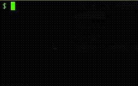
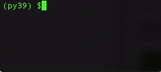
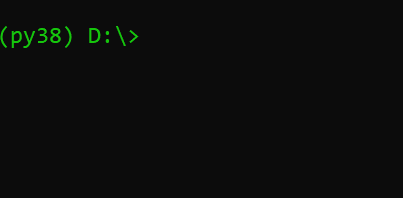
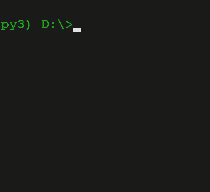
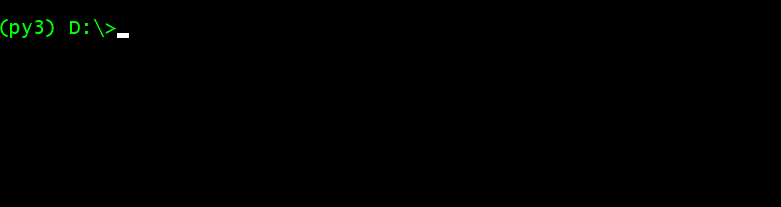
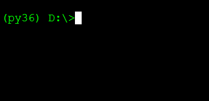
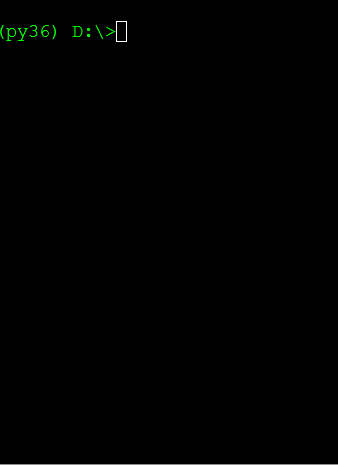

# PyChristmasTrees

A collection of Python tweet size snippets that output something fun like **Christmas trees**

## Happy 2024

[code](happy2024.py) | no description yet 

## Happy 2023

[code](happy2023.py) | no description yet 

## Bye 2021

[code](bye2021.py) | [description](bye2021.md)

## Inject 2021

[code](inject2021.py) | description not yet

## Happy 2020

[code](happy2020.py) | description not yet

## End of 2018

[code](2018.py) | description not yet

## Christmas 2017

[code](christmas2017.py) | [description](christmas2017.md)

## Happy 2017

[code](happy2017.py) | [description](happy2017.md)

## Chirstmas trees 

[code](christmas.py) | [description](christmas.md)

