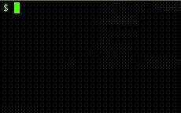

# Bye 2021

[Back](README.md)

[Conway's game of life](https://en.wikipedia.org/wiki/Conway%27s_Game_of_Life) implementation starting from the digits **2021**.

## Code

```python
n,P={},lambda w,h,H=5,W=15:[(h+i//W,w+i%W)for i in range(W*H)]
g,G=dict(zip(P(9,2),f'{0x77762a25d5ca2a17777:b}')),lambda x:int(g.get(x,0))
while 1:
 for p in P(0,0,9,32):y,x=p;V,S=G(p),sum(map(G,P(x-1,y-1,3,3)));n[p]=V&(2<S<5)|(V^1)&(S==3);print(' *'[V],end='\n'[31-x:])
 g={**n}
```

## Output



## Description

The main aspect of the code deals with the `g` variable. This refers to a dictionary with 2D position keys as tuple `(y,x)` and binary `0` or `1` values indicating if the "cell" at that position is alive (`1`) or dead.

The first part of the code deals with setup and the final loop performs the *Game of life* logic and printing.

### Line 1

```python
n,P={},lambda w,h,H=5,W=15:[(h+i//W,w+i%W)
```

This line defines two variables.

* `n` an empty dictionary used later in the *Game of life* loop. In the loop the `n` data is updated based on the curretn `g` data. At the end `g` is replaced with the content of `n`
* The `P` function is the "workhorse" of this code. It generates a list of `(y,x)` positions in a rectangular grid. The grid is offset at the positiont `(h,w)` and has dimensions of *height x width* of `H*W`.
The values `H=5` and `W=15` are the defaults used later to render the **2021** digits.
For all values `i` in the range `H*W` the `y` and `x` values are computed.
The `y` values are obtained by taking the truncated division `//` of `i` and `W` and offseting (adding) them with `h`.
The `x` values are obtained using the modulo `%` (e.g. remainder after division) of `i` and `W` and offset with `w`.

## Line 2

```python
g,G=dict(zip(P(9,2),f'{0x77762a25d5ca2a17777:b}')),lambda x:int(g.get(x,0))
```

This line defines the `g` variable and the helper function `G`. Let's first look at `g`.

### Line 2 - `g`

```python
g=dict(zip(P(9,2),f'{0x77762a25d5ca2a17777:b}'))
```

The dictionary `g` is constructe from a list of key-value pairs created using the `zip` function. 

The **keys** are created using the `P` function. This defines a list of 2D coordinates starting at position `(2,9)` (notice the `w` and `h` arguments are reversed e.g `(x,y)` with respect to the standard `(y,x)`, not good I know). Since no other arguments are give the grid will have the default dimension of `H=5` and `W=15`. The position values are returned in row-first order like below

```
# -> increment in x first
(2, 9) (2,10) (2,11) ... (2,14) # |   
(3, 9) (3,10)  ...   ...  ...   # v increment y
(4, 9)  ...    ...   ...  ...   #
(5, 9)  ...    ...   ...  ...
(6, 9)  ...    ...   ...  ...
(7, 9)  ...    ...   ... (7,14)
```

The **values** are created from the single hexadecimal number `0x77762a25d5ca2a17777`.
This number if converted to a binary representation using the *f-string* notation `f'{...:b}`.
This results in the following string

```
111011101110110001010100010010111010101110010100010101000010111011101110111
```

When the string is wrapped in lines of width of `15` (rememeber the `W=15` argumen in `P`), we obtain

```
111011101110110
001010100010010
111010101110010
100010101000010
111011101110111
```

When outputting each `0` as and empty space ` ` and each `1` as an `*` we obtain our initial **2021** digits

```
*** *** *** ** 
  * * *   *  * 
*** * * ***  * 
*   * * *    *
*** *** *** ***
```

To create this hexadecimal representation a helper script is used. See [by2021_prepare.py](by2021_prepare.py).

### Line 2 - `G`

```python
G=lambda x:int(g.get(x,0))
```

This function is used to read the values in the `g` dictionary. It allows to read outside of the set data (e.g. outside of the defined grid) and also does the conversion to `int`. This allows the `g` dictionary to hold both real integers and `str` data.
This is last type of data is what's get loaded initially using the hex representation above.

## Lines 3 and 4

```python
while 1:
 for p in P(0,0,9,32):y,x=p;V,S=G(p),sum(map(G,P(x-1,y-1,3,3)));n[p]=V&(2<S<5)|(V^1)&(S==3);print(' *'[V],end='\n'[31-x:])
```

This block defines the main loop that runs forever (`while 1`). Let's first make the loop more easily readable by converting the `;` to newlines and add proper indentation.

```python
while 1:                                    # 3
    for p in P(0,0,9,32):                   # 4-a
        y,x=p                               # 4-b
        V,S=G(p),sum(map(G,P(x-1,y-1,3,3))) # 4-c
        n[p]=V&(2<S<5)|(V^1)&(S==3)         # 4-d
        print(' *'[V],end='\n'[31-x:])      # 4-e
```

Inside the never ending `while 1` loop, we see the second use of the `P` function in the code. 
Here (**4-a**) it is used to loop over all grid positions we want to visit. The `p` variable will trace all position in the rectangle starting at position `(0,0)` with a height of `9` and a width of `32`.

In part **4-b** the `p` tuple is unpacked into the `y` and `x` components.

Next the **4-c** section defines two variables

* `V=G(P)` which is the current value in the grid obtained using the earlier defined `G` method.
* `S=sum(map(G,P(x-1,y-1,3,3)))` which holds to sum of all the values in a `3x3` neighborhood region around the current `y` and `x` position. Again here the `P` function is used to easily obtain the grid positions in this neighborhood. With the help of the `G` function all the values can be easily extracted using the `map` function. Finally the `sum` function simply adds all the values in the neighborhood. 

Notice that the `S` value also adds the value of the current position to the sum, since the neighboorhood positions obtained from the `P` function also also include the current `y` and `x` position.

### Game of life rules

Next part **4-d** define the "Game of life" rules in the code

```python
n[p]=V&(2<S<5)|(V^1)&(S==3) 
```

Let's recap the original [rules](https://en.wikipedia.org/wiki/Conway%27s_Game_of_Life#Rules).

    1. Any live cell with two or three live neighbours survives.
    2. Any dead cell with three live neighbours becomes a live cell.
    3. All other live cells die in the next generation. Similarly, all other dead cells stay dead.

The first thing to consider for all these rules is that they apply simultaniously to the current state of the grid `g` to generate the next state. That is why we have a second dictionary `n` defined which holds the output (`n[p]`) for the next generation grid.

Next we will the the `V` data to figure out if the current cell is alive (`1`) or dead (`0`). Also the value of `S` will define the number of alive cells in the `3x3` neighborhood. Again notice this also includes the alive status of the central position e.g. the current position `p` under evaluation.

Next the expression `V&(2<S<5)|(V^1)&(S==3)` encodes the two cases (separated by `|`) when the current position should stay (*rule 1*) or become (*rule 2*) alive. This includes a number of [binary bitwise operations](https://docs.python.org/3/reference/expressions.html#binary-bitwise-operations) that allows to encode some of the logic compactly.

First, `V&(2<S<5)` which checks if the number of alive cells `S` is equal to `3` or `4`, but only if the current cell `V` is alive by means of the *binary AND* `&` operator. This implements **rule 1**. Notice, that the rule mentions `2` or `3` neighbors, but we check for `3` and `4` in the code. However, as mentioned before the sum `S` include the central position. Since we know this position is alive (`V`) the sum should be one higher for than the rule mentiones to have the required number of "alive" neighbors.

Secondly, the part `(V^1)&(S==3)` encodes for **rule 2**. First, the `V^1` expression uses the *XOR* operation to only be `True` when `V==0` e.g. when the current cell is dead.

```
V | V^1
--------
0 |  1
1 |  0
```

Next, the expression `S==3` simply checks that their are `3` live neighbors. Again, the sum `S` does not only count for the neighbors but also the current gird position. However, since we have verified that the current position is "dead" (`V^1`) the sum is not numerically affected and we can simply check for the expected value `3` from the rule.

Finally, if neither *rule 1* (`V&(2<S<5)`) or *rule 2* (`(V^1)&(S==3)`) apply (checked using the *OR* operator `|`) than the cell in the next generation stays or becomes dead, obaying **rule 3**.

## Line 4-e: Printing

At this point for each position in the grid `g` the value in the next generation `n` is computed. The part **4-e** now actually prints something on the screen.

```python
print(' *'[V],end='\n'[31-x:])
```

The code above is executed for each position `(y,x)` in the grid. From the previous section we also know that the variable `V` indicates if the current cell is alive (`1`) or dead (`0`).

First, the actual alive or dead state is represented by indexing into the ` *` string. At the "dead" index `0` an empty string ` ` is printed. At the "alive" index `1` the `*` symbol is printed.

Next, since normally the `print` function adds a new line at the end we need to disable this get all cells in the same row to be printed on the same line. However, at the end of each row we do want to go to a new line (e.g. print a `\n` character).

This is accomplished by the `end='\n'[31-x:]` keyword argument to `print`. Recall that the positions `p` are traversing the the grid in a row like manner, where the `x` position is increases fastest up to the width (`32`) of the grid and starts again at `0` on the next row. This means `x` takes the values `0,1,2,3,..etc` and has `31` as highest value.
The expression `'\n'[31-x:]` extracts the slice `[31-x:]` from the string `\n`. For alomst all the values of `x` the slice goes beyond the length of the string (`31-x>0`) (which is just a single character) and returns an empty (`''`) string. Only when `x==31` so at the last position in each row the slice results in `'\n'[0:]` which returns the `'\n'`.

## Line 5

The last line has the expression `g={**n}`. This gets executed after all values in `n` are computed and all the current values in `g` are printed. It simply creates a copy of `n` and assigns it to `g`.


