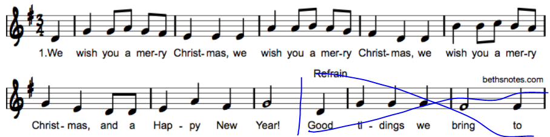

# Christmas 2017

[Back](README.md)

Prints `We whish you a merry Chirstmas!` notes.

Created as a [tweet](https://twitter.com/pkitslaar/status/945222840210649088). Since Twitter [decided](https://blog.twitter.com/official/en_us/topics/product/2017/Giving-you-more-characters-to-express-yourself.html) to increase the
length of tweets to be 280 characters, that was also the limit for the length of the code.

## Code

```python
H,b='FEDCBAgfed','|'
n='&g#F3D/D4Dd|4g8gAgf|4eee|4A8ABAg|4fdd|4B8BCBA|4ge8dd|4eAf|2g'.replace(b,'|ECAf d')
i,I=2,iter(n)
l={c:[k]*64 for k,c in zip('- '*5,H)}
for x in I:
 if not x in H:
  c,x=x,next(I)
 l[x][i]=c
 i+={'4':2,b:0}.get(c,1)
 print(*map(''.join,l.values()),sep="\n")
```

## Output


## Description

The first 4 lines of the code deal with the setup of the variables and the main data storage
dictionary `l`. This dictionary is the actual staff that gets printed in the last line of the code.

### Line 1

```python
H,b='FEDCBAgfed','|'
```

The first line defines two variables `H` and `b`.  
Here `H` defines the note names of the positions on the staff from high to low. Here captial letters are used to define the notes an octave above the lower case note names. 
The `b` variable is used to keep a reference to the `'|'` character, which is used to indicate end of
a bar in the staff.

Next, we will discuss line 4, which holds the actual staff data that will be printed.

### Line 4

```python
l={c:[k]*64 for k,c in zip('- '*5,H)}
```

The variable `l` is a dictionary with keys the note names on the staff and with values a
list of characters for each line.

Here dictionary comprehension is used to define the dictionary. The code
```python
{c:[k]*64 for ...}
``` 
reads as. Create a dictionary with a key from variable `c` and values `[k]*64`.
This last part creates a list with 64 copies of the value `k`.

The end part of the dictionary comprehension defines the values for `k` and `c`.

```python
{... for k,c in zip('- '*5,H)}
```
Here the `k,c` unpacks to tuples returned by the `zip` expression.
The zip expression combines the values from the two sequences and returns pairs for each side.

The first sequence is a character string with alternating `'-'` and `' '` characters, repeated 5 times.
So this could also be written as `'- - - - - '` but that would take 4 characters more.

The second sequence are the names of the note positions defined in `H`.

The alternating `k` values, make sure that there will be lines and spaces in note staff.

The final content of `l` after the execution of this line will look like.

```python
{
'F': '----------------------------------------------------------------',
'E': '                                                                ',
'D': '----------------------------------------------------------------',
'C': '                                                                ',
'B': '----------------------------------------------------------------',
'A': '                                                                ',
'g': '----------------------------------------------------------------',
'f': '                                                                ',
'e': '----------------------------------------------------------------',
'd': '                                                                ',
}
```

Since the dictionary was created using the dictionary comprehension and the keys were
given in a fixed order the new Python 3.6+ version, retains the [order](https://docs.python.org/3.6/whatsnew/3.6.html#whatsnew36-compactdict).

### Line 2

This line holds the actual content to be printed "on-top" of the staff. These are the notes, the bar lines but also the 
clef, time- and key signatures.

```python
n='&g#F3D/D4Dd|4g8gAgf|4eee|4A8ABAg|4fdd|4B8BCBA|4ge8dd|4eAf|2g'.replace(b,'|ECAf d')
```

The musical arrangment used is taken from the following [sheet music](http://www.bethsnotesplus.com/2014/07/we-wish-you-merry-christmas.html), and only the first melody part is used.



The actual syntax of this string will be discussed later.

### Line 3

This line setups a loop variable `i`, which indicates the horizontal position of the to be inserted symbol on the staff.
It is initialized with the value `2`, so the first two "columns" on the staff will be empty.

The other variable that is initialized is the `I` with value `iter(n)`. This is an iterator over the `n` string.
An explicit iterator is used instead of a normal `for` loop over `n` since we would like to have more control when to advanved to the next character in the main loop.

### Line 5

This is where the main loop starts.

```python
for x in I:
```

This simply takes the next element from `I` and stores it as `x`.

### Line 6 & 7

These lines form the main logic of the iteration and also can be used to explain the syntax of `n`

```python
if not x in H:
 c,x=x,next(I)
```
First, we if the current value of `x` is defined in `H`. So, this means we check if the
current character `x` from `n` is a note height, and thus a key in the `l` dictionary.
If this is NOT the case we store the value of `x` in the variable `c`, and make `x` the next
element from `I`.

If we now look at the content of `n` we mostly notice an alternating pattern of characters
inside and outside the set of the characters of `H` e.g. the note names.

First a character that is NOT in `H` is set, like `'&'` for the first character in `n`. 
Next, a character that IS in `H` is defined, in this case the second character `'g'`.

So, for the first 10 characters the following values for `x` and `c` are obtained.

```
c x
---
& g
# F
3 D
/ D
4 D
```

However, for the 11th character we see `'d'`, which is a member of `H`. This means the code in the
`if not x in H:` block is not run. So, only the `x` variable is updated, and the `c` keeps its previous value.

This logic allows the compress the notation of the notes in the `n` string. If only the height of the note
is changed but the symbol used to print it is the same, that symbol does not need to be repeated in the string.

So, looking at the characters of `n` in the second bar, the following compression is applied.

```python
'4g8gAgf'    # compressed
'4g8g8A8g8f' # full
```

The last, 3 notes are all `8` notes and therefor the `8` does not need to be repeated in `n`.


### Line 8
Here we set the value `c` in the dictionary `l` at key `x` (so the note height) at position
`i`.
