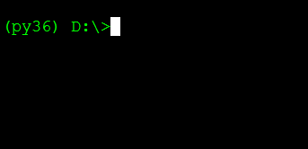

# Happy 2017

[Back](README.md)

Prints `2017` in big fonts with varying fill characters.

Created as a [tweet](https://twitter.com/pkitslaar/status/815238499175538688), so needed to fit in 140 characters.

## Code

```python
for v in '~Xx*':
 print(''.join({'!':'\n'}.get(c,f'{ord(c)-60:06b}0') for c in '!zZB{!]]F>!>]N@!@]>D!L]>D!{Z[D').translate({48:32,49:v}))
```

## Output



## Description

The main part of this snippet revolves around the creation of the big 2017 characters. They are encoded in the large string enclosed in the generator expression on the second line.

The large string looks like this.

```python
 '!zZB{!]]F>!>]N@!@]>D!L]>D!{Z[D'
```

We will ignore the `!` in the string for now, they have a special meaning we will see later. We than find 6 chunks of 4 characters each.

```python
'zZB{'
']]F>'
'>]N@'
'@]>D'
'L]>D'
'{Z[D'
```

These codes are obtained from the (happy2017_fonts.py) script.

### Encoding

In the final script the goal is to create large characters to spell the year `2017`. Like

```
XXXXX   XXXX     XX  XXXXXX 
X    X X    X   X X      X  
    X  X    X  X  X     X   
   X   X    X     X    X    
 X     X    X     X    X    
XXXXXX  XXXX   XXXXX   X    
```

It would take too much space in the code snippet to spell out all the characters. The above text already occupies 175 characters/bytes. 

First, we isolate each digit and handle this. Let's look at the `2`.
Here we also number the columns and rows in the grid.

```
  012345
  ------
0|XXXXX   
1|X    X  
2|    X   
3|   X    
4| X      
5|XXXXXX  
```

As can be seen the digit is made of a `6x6` grid. 
To encode this more efficiently we regard each row in the grid to be a bit pattern. 
Here tthe `X` represents a `'1'` and each `' '` (space) represents a `'0'`. 
So, each row represents an 6-bits number.

> **Intermezzo: Unicode and ASCII**
> In the digital world, all text characters are represented as integer values. 
> The most complete numbering system to represent characters is Unicode. 
> Each character in Unicode is represented by a code point, which is just a number. 
> Almost every character in the world (real or fictional) has a Unicode code point value. 
> However, for our purpose we will only use very low numbers below 128. 
> In this range the Unicode code points map to the old ASCII system.
> 
> In Python the conversion between characters and their numeric value is done using the `chr` and `ord` built-in functions. 
> Below, are the help texts for `chr` and `ord`.
> 
> ```
> chr(i, /)
>     Return a Unicode string of one character with ordinal i; 0 <= i <= 0x10ffff.
> 
> ord(c, /)
>     Return the Unicode code point for a one-character string.
> ```

Based on this knowledge, we can lookup the ASCII character that is represented by the value of the bit patters in each row. 
However,  all numbers below 32 are non-printable characters which cannot be copy-pasted into a text box.
Therefore, we add `60` to the original bit-pattern value to get characters in the range of values that can be printed. 
Since the maximum value for a 6-bits integer is 63 we will never get above the 127, the end of the ASCII table.

The schematic below shows the bits and the corresponding value for the rows in the `2` figure. 
Also the original ASCII character and the value and character of the value plus 60 are shown.

```
  012345 bits   value  c    +60  c+60
  ------ -----  -----  -    ---  ----
0 xxxxx  111110 62     >    122  'z'
1 x    x 100001 33     !    93   ']'
2     x  000010 2      SOH  62   '>'
3    x   000100 4      EOT  64   '@'
4  x     010000 16     DLE  76   'L'
5 xxxxxx 111111 63     ?    123  '{'
```

Now we can interpret the output of the [happy2017_fonts.py](happy2017_fonts.py) script.

```shell
$ python happy2017_fonts.py
2 z]>@L{
0 Z]]]]Z
1 BFN>>[
7 {>@DDD
```

The fist column in the output is the encoded character 
the following columns define the symbolds that encode the bit pattern
for each row.

### Decoding

Let's look again at the character groups we isolated before.

```python
'zZB{'
']]F>'
'>]N@'
'@]>D'
'L]>D'
'{Z[D'
```

If we look close we see that the first character of each group comes from the encoding of the character `2`.
The second characer in each group comes from the character `0`, etc.

So, the first group contains the encoded bit pattern for the first rows of all the characters `2`,`0`,`1` and `7`.

Let's look at the part of the code that deals with the encoded data.

```python
{'!':'\n'}.get(c,f'{ord(c)-60:06b}0') for c in '!zZB{!]]F>!>]N@!@]>D!L]>D!{Z[D'
```

The first part simply defines a dictionary with a single entry mapping `'!'` to `'\n'`.

Next, there is a `get` call on the dictionary with the key `c` which iterates over all the characters (including the `'!'`) in the
encoded data string. The `get` has a second argument which is the value it returns when the key `c` is not found in the dictionary.
The real decoding part takes place in this second argument which is a  `f-string` definition 

```python
f'{ord(c)-60:06b}0'
```

The `f-string` contains the expression `ord(c)-60` inside the braces left of the `:`.
This calls the `ord` method with argument `c`. This converts the 
character to its Unicode code point value. As mentioned in the encoding part, we altered the
value of the bit-pattern before converting it to a character by adding `60`. Therefor, we
here subtract the `60` again to obtain the original value of the bit-pattern.

The to right of the `:` we see the format specifiers `06b`. The easiest is the read these from right to left

 * `b` : Convert the value to a binary string format e.g. `'00110101'`
 * `6` : Make sure the string is a least `6` characters wide.
 * `0` : Use the `'0'` character to pad the string if needed to fill to the defined width of 6 characters.

Finally, the `f-string` ends with a standard `'0'`.

The result of this expression for the `'z'` character (the first encoded row from `2`) is:

```python
'1111100'
```

For every `!` in the data string a `\n` is returned. Therefor, the first 7 characters on the data string decode to:

```
!  z        Z        B        {        ! 
-  -------- -------- -------- -------- --
\n 111110 0 011110 0 000110 0 111111 0 \n
```

So the expression

```python
{'!':'\n'}.get(c,f'{ord(c)-60:06b}0') for c in '!zZB{!]]F>!>]N@!@]>D!L]>D!{Z[D'
```

results in a sequence of characters with values `'0'`, `'1'` or `'\n'`.

### Filling

Lets look back at the second line of the snippet. We just covered the internal part, which is replaced with `...` in the code below.

```python
 print(''.join( ... ).translate({48:32,49:v}))
```

The first thing this does is the `''.join( ... )` call. Which simply takes the generated sequences of characters in `...` and
concatinates them into a single string.

Next, we look at the part:
```python
.translate({48:32,49:v})
```

This calls the `translate` method on the concatinated string. Below is the help text for `str.translate`. 

```
translate(...)
    S.translate(table) -> str
        
    Return a copy of the string S in which each character has been mapped
    through the given translation table. The table must implement
    lookup/indexing via __getitem__, for instance a dictionary or list,
    mapping Unicode ordinals to Unicode ordinals, strings, or None. If
    this operation raises LookupError, the character is left untouched.
    Characters mapped to None are deleted.
```

The table that is used contains two entries

 * `48` : Which is the Unicode ordinal for the character `'0'`, which is mapped to `32` the Unicode ordinal for `' '` (space).
 * `39` : The Unicode ordinal for the character `'1'`, which is mapped to `v`. This is the value as provided by the loop on line 1.

This means that every `'0'` in the concatinated string is converted to a `' '` and every `'1'` is converted to the value of `v`.
The new line characters (`'\n'`) in the string are left untouched since no entry is present in the table.

