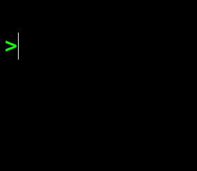

# Happy 2026

[Back](README.md)

Prints `2026` using [box drawing characters](https://en.wikipedia.org/wiki/Box-drawing_characters) by modifying a random selection of these characters in a grid to the final solution. Also uses [ANSI escape codes](https://en.wikipedia.org/wiki/ANSI_escape_code) to produce colored output and a smooth screen refresh.

Idea for this setup came afer watching a YouTube video from Compterphile on [Procedural Generation in Games](https://www.youtube.com/watch?v=G6ZHUOSXZDo). In the end this implementation is not really applying the "wave function collapse" concept but I initially started with the idea to try to replicate it.

## Code

```python
E,R,T,G,P,r='\033[',1,[*'─┐┌─┐─┐┌─┐\n┌┘│ │┌┘├─┐\n└─└─┘└─└─┘'],[' ']*32,print,range
G[10::11]='\n'*2;P(f'{E}2J{E}?25l')
while G!=T:
 p=R%32;R+=15
 if G[p]!=T[p]:
  G[p]='├─│┌┐└┘'[R%7]
 [P(f'{E}H',*[[c,f'{E}9{p%5}m{c}{E}0m'][c==t]for c,t in zip(G,T)],sep='')]*(30<<19)
P(f'{E}?25h')
```

## Output



## Description


### Main Loop
The core of the code is in the `while` loop.

```python
while G!=T:
 p=R%32;R+=15
 if G[p]!=T[p]:
  G[p]='├─│┌┐└┘'[R%7]
```

Here `G` and `T` are two lists of characters. `G` is the Grid that gets updated and printed to the screen and `T` is the Target solution that we want to find.

Every run of the loop we pick an index `p` in the lists `G` and `T` and compare the values. If they are not the same we set `G[p]` with a new character.

The choice for the index `p` and the new update character for `G[p]` is controlled by the integer `R`

> The choice for the variable `R` comes from earlier experiments where I was using
> and actual `random.choice` call to get a random position and character. 

The variable `R` is incremented with `+15` each loop and the `p` index is taken as `p=R%32` to make sure the index fits within the size of 32 of the lists `G` and `T`

The choice of the new character `G[p]` when needed comes by indexing the the string `'├─│┌┐└┘'` with `R%7`. Again to make sure we don't go beyond the size of the array.

> Notice the `'├─│┌┐└┘'` does not contain the new line character `\n` which 
> is part of `T` as during [Initialisation](#initialisation) of the `G` these are already setup.
> Adding them to the selection would yield distorted printed grids.

### Initialisation

The first two lines in the code perform the initialisation of all the variables
and creates aliases for smaller code.

```python
E,R,T,G,P,r='\033[',1,[*'─┐┌─┐─┐┌─┐\n┌┘│ │┌┘├─┐\n└─└─┘└─└─┘'],[' ']*32,print,range
G[10::11]='\n'*2;P(f'{E}2J{E}?25l')
```

The first line can be unravelled to the following code

```python
# ANSI-Escape prefix (including [) for screen control codes
E = '\033['  

# `Random` loop counter that gets incremented in the while loop
# Note: setting this to a different initial value will produce a different
# number of cycles and appearance of the transition to the final target
R = 1  

# The target list of characters.
# converted from a str to a list using the list comprehension syntax
T = [*'─┐┌─┐─┐┌─┐\n┌┘│ │┌┘├─┐\n└─└─┘└─└─┘'],

# The grid that gets updated and printed
# Initialized as an empty list of spaces
G = [' ']*32

# aliases for print and range
P = print
r = range
```

The second the the following two things.

```python
G[10::11]='\n'*2
```

This injects the end of line character `\n` at positions `10` and `21` in the list `G`. 

> Initially this code was written as
> ```python
>  G[10]=G[21]='\n'
> ```
> It has the same number of characters and does the same thing.
> Here, I just choose the first form as it looked a bit more complex
> adding to the kind of the magic of what this code is doing.

The second statement is

```python
P(f'{E}2J{E}?25l')
```

This comes down to printing two ANSI escape code.

**Clear screen**

```python
# P(f'{E}2J)

# P => print
# E => '\033[`

print('\033[2J')
```

Here `\033[` is the ANSI [Control Sequence Identifier](https://en.wikipedia.org/wiki/ANSI_escape_code#Control_Sequence_Introducer_commands) (CSI) start code.

`2J` in this code defines an `ED` or `Erase Display` code. The `2` indicates to erase the entire screen and place the cursor at the top left of the screen.

**Hide cursor**

The second code

```python
# P(f'{E}?25l')

print('\033[?25l')
```

Here `?25l` is the private sequence that indicates we want to hide the cursor.
This is purely easthetic

### Printing in the while loop

Inside the `while` loop the current state of the `G` list is printed with
the line

```python
[P(f'{E}H',*[[c,f'{E}9{p%5}m{c}{E}0m'][c==t]for c,t in zip(G,T)],sep='')]*(30<<19)
```

Lets ignore the starting `[` and ending `]*(30<<19)` part for now and look at

```python
P(f'{E}H',*[[c,f'{E}9{p%5}m{c}{E}0m'][c==t]for c,t in zip(G,T)],sep='')
```

This is using a single print statement to print a list of argument.
THere is no space between the arguments as we set the keyword argument 
`sep=''`.

**Reset position**

The first argument is `f'{E}H'` which convert to `\033[H` which is the ANSI CSI to move the cursor to the top left of the screen.

> In principle the CSI for the cursor movement takes the form
> `CSI n ; m H` where `n` is the row and `m` is the column.
>
> However when any of these arguments are not provided they are assumed
> to be `0`. So `CSI 0; 0H` is the same as `CSI H` (spaces added for clarity).

**Character printing**

The next arguments are all the indiviual characters in the `G` list.
The are unpacked as arguments using the `*[...]` notation.

Lets look at the inner list comprehension.

```python
[[c,f'{E}9{p%5}m{c}{E}0m'][c==t]for c,t in zip(G,T)]
```

We are looping over the zipped elements from `G` and `T` as variabels `c` and `t`.

> `c` could have better be named `g` to be more consistent.

So for each pair `c,t` the following expression is executed

```python
[c,f'{E}9{p%5}m{c}{E}0m'][c==t]
```

The first part creates a list of two element `[c, ...]`.
The second part indexes into this list with index `c==t`.
This is a boolean expression which results in choosing index `0` if False 
and index `1` when the expression is True.

When `c!=t` we pick the first element which is simply `c`.

Hence when `c==t` is True, so the current character in `G` is equal to the
corresponding character in `T` we pick the second argument from the list.

This second element, the matching `G` and `T` characters are printed as

```python
f'{E}9{p%5}m{c}{E}0m'
```

When we unpack this (and add spaced for clarity) it can be seen as three parts

```python
f'\033[ 9{p%5} m   {c}   \033[ 0 m'

# ----- ------ -   ---   --------- 
#   |      |   |    |         |
#  CSI   value              reset
#
#      (1)          (2)      (3)
#        
#      set
#   font color
```

Here the first `(1)` part `f'\033[9{p%5}m'` uses the `p` variable which is the
current index in the list to cycle through the number `0, 1, 2, 3, 4` due to the `%5` operator. 

This results in any of the following codes which are the ANSI color codes
to change the foreground color.

```python
'\033[90m' # Gray
'\033[91m' # Bright Red
'\033[92m' # Bright Green
'\033[93m' # Bright Yellow
'\033[94m' # Bright Blue
```

The second `(2)` part simply prints the characer `c`.

The third `(3)` part outputs the `\033[0m` which resets all the color changes.

### Time delay

To make the animation not run too fast an artifical time delay is created.

This is done by taking the print line described above and executing it many time.

The code

```python
[P(...)]*(30<<19)
```

Create a list by calling the `P(...)` statement many times. It also creates a growing lists of `None` values which is the return value of the `P(...)` call.

The amount of repetitions is `30<<19` which is the value `30` bit shifted with `19` positions. This results in the value `15_728_640`.
This value was 'tuned` on my laptop to make the animation not run to fast.

> Note: In the past I would use an implicit `time.sleep(..)` in these code
> but this year I thought it would be nicer to make the code actually run
> at the speed the gif is created at.

### Clean up

At the end of the `while` loop the list `G` is equivalent to `T` and
the final text is printed.

```
─┐┌─┐─┐┌─┐
┌┘│ │┌┘├─┐
└─└─┘└─└─┘
```

Before the script exists we show the cursor again to be nice
to the people running the script in a terminal

```python
P(f'{E}?25h')
```

This comes down to printing `CSI ?25 h` which is the counter part to
the code we saw in the [initialisation](#initialisation) part which was
hiding the cursor.
